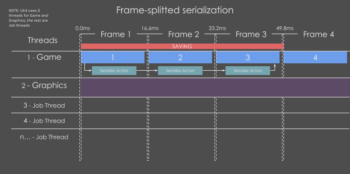

# Asynchronous

Asynchronous loading and saving is one of the most requested features of the plugin.

Saving and Loading process can be asynchronized, speeding up the process, making it super efficient.

There are currently three types of parallelization:

- Multithreaded Serialization
- Frame-splitted Serialization
- Multithreaded Files

All of them can be configured to be used while saving, loading or both.

## Multithreaded Serialization

Multi-threaded serialization will split the **serialization** (*data collection from the world*) between all available threads on the CPU.

This means platforms with many cores like modern CPUs will obtain very noticeable performance advantages.

## Frame-splitted Serialization

**Serialization** (*data collection from the world*) will be splitted between multiple frames, taking *MaxFrameMS* (5ms by default) every frame until it finishes.

This method is only available if [Multithreaded Serialization](#multithreaded-serialization) is disabled.

 Frame Splitting is not recommended if level streaming saving is enabled. It could be interrupted while loading or saving creating unexpected issues 

## Multithreaded Files

**Files** will be compressed and saved/loaded asynchronously on the background.

Its great to avoid the small performance cost of compressing saved games. Usually you would just keep it enabled, but you have the option to disable it.

