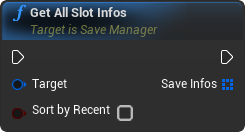

# Slot Templates

## Slot Info

**Slot Infos** are SaveGame Objects used to identify a saved game. They hold all information that needs to be accessible while the game is **NOT** loaded. 

It can for example hold the name of the game, the progress of the player, the current quest or the level.

Slot Infos are also used directly to load or save games. You can load all available infos and make the player decide which one to load from UI.

#### Get All Slot Infos

*May be expensive, use with care*

 

#### Get Slot

*May be expensive, use with care*

 

### Custom Slot Infos

You can also create your own slot infos and store anything you want on them. Like a normal SlotInfo, your variables will be available when you load the slot (it will only need casting to your class).

1. Create a Blueprint child of *"SlotInfo"*

    

2. Assign it into your active [Preset](presets.md)

## Slot Data

Same as Slot Info objects, **SlotData** is a SaveGame Object, meaning all its properties will be saved.

**Slot Datas** are designed to hold all the information about the world and the player. All information that will be only accessible during gameplay.