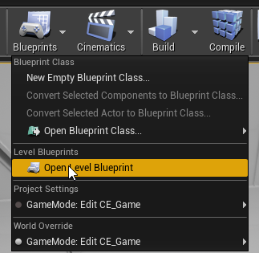
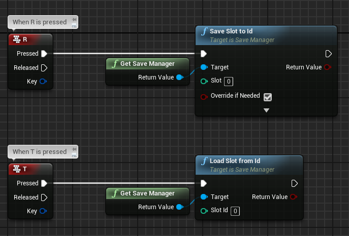
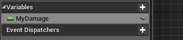
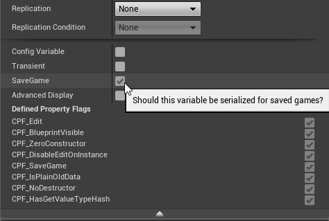

# Quick Start

Quick Start will show the basic steps to follow to setup the plugin and start using it at a base level.

## Setting Up the Project

We can start by creating an empty project ([How to create UE4 projects](https://docs.unrealengine.com/en-US/Engine/Basics/Projects/Browser)) or using your own and then installing the plugin into it, from marketplace or inside *Plugins* folder (See [Installation](installation.md)).

If everything went right we should see the plugin enabled under *Edit->Plugins->Piperift*

## Using the Plugin

Save Extension requires minimum setup. The only thing you have to do is to call Saving and Loading. Therefore **as an example** we will make a level-blueprint **save** when we press **R** and **load** with **T**.

Lets start by opening the level-blueprint of the scene we want to use:

Then we add the following functions:

**Save Slot to Id** will save the world into slot 0 and override if another save was there.

**Load Slot from Id** will load world from slot 0

### Something to save

Player's rotation and location will always be saved (unless you disable it from [Configuration](documentation/configuration.md)) but we can also add to the scene some actors to be saved. They could save variables, physics, positions, etc.

### Saving a variable

To save any variable inside an Actor or Component we can just tick "*SaveGame*" on its properties:

