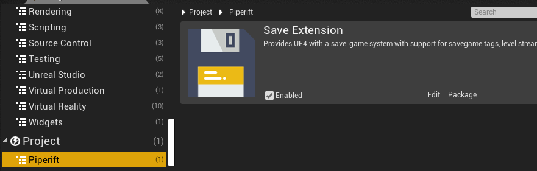

# First Steps

First Steps will show the basic steps to follow to setup the plugin and start using it at a base level.

## Setting Up the Project

We can start by creating an empty project ([How to create UE4 projects](https://docs.unrealengine.com/en-US/Engine/Basics/Projects/Browser)) or instead using your own. Then installing the plugin from marketplace or inside Plugins folder (See [Installation](installation.md)).

If everything went right, we should see the plugin enabled under *Edit->Plugins->Piperift*

## Save and Load from Keys

Save Extension requires minimum setup. The only thing you have to do is to call Saving and Loading. Therefore **as an example** we will make a level-blueprint **save** when we press **R** and **load** with **T**.

Lets start by opening the level-blueprint of the scene we want to use:

Then we add the following functions:

**Save Slot to Id** will save the world into slot 0 and override if another save was there.

**Load Slot from Id** will load world from slot 0

## Selecting Actors and Components to save

**SaveExtension** doesn't save any actor class or component **by default**.

*I  know. It is confusing that a save system by default doesn't save, but it will make sense by the end of this page, I promise.*

To be able to save, we will need to:

1. Create a [**SavePreset**](presets.md) blueprint (that inherits ***USavePreset***)
2. Add actor and component classes relevant to be saved in the game to preset filters
   
3. Assign the preset inside Project Settings
   

 For detailed info see [**Save Presets**](presets.md) and [**Filters**](filters.md) 

## Marking variables to be saved

To save any variable inside an Actor or Component we can just tick "*SaveGame*" on its properties (*however remember that his actor or component class must on the filter*)

