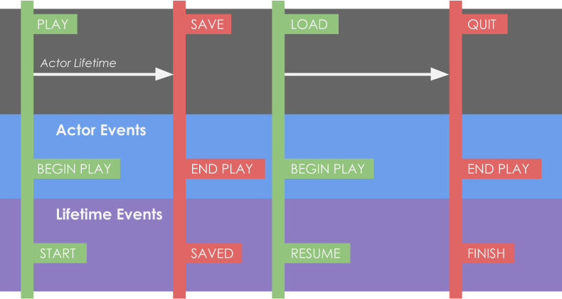

# Lifetime Component

Lifetime components are an optional feature. Their single purpose is to offer **events called in relation to the saved lifetime** of the actor.

They are **not necessary** by any means to save your game since they only add some useful events.

## Why shouldn't I use BeginPlay?

BeginPlay gets called every time the actor is created. This includes when game starts, but also when game loads and the actor didn't exist (so it gets spawned).

That is why BeginPlay is not a good representative of the lifetime of the actor. With that, Lifetime events can help, providing precise events that notify when the actor has been created for the first time, loaded, saved, etc.

## Events

### Started
Gets called only first time an actor is created.

- When you start a new game
- When you spawn the actor
- Wont be called when you load any game (**Resume** will be called instead)

### Saved
Called when this actor is saved

### Resume
Called when this actor is loaded. When opening a saved game from any level in any situation

### Finish
Similar to EndPlay, but gets called when this actor **gets destroyed during gameplay or at normal endplay**. But wont be called when you load a game and this actor gets destroyed as a consequence.