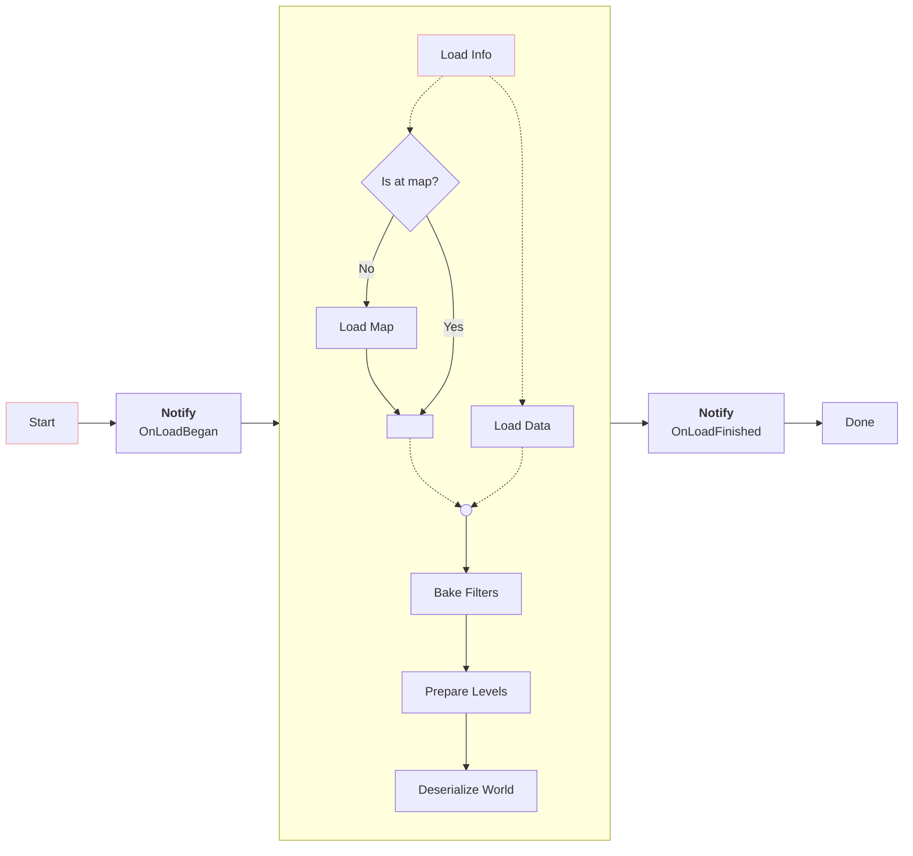
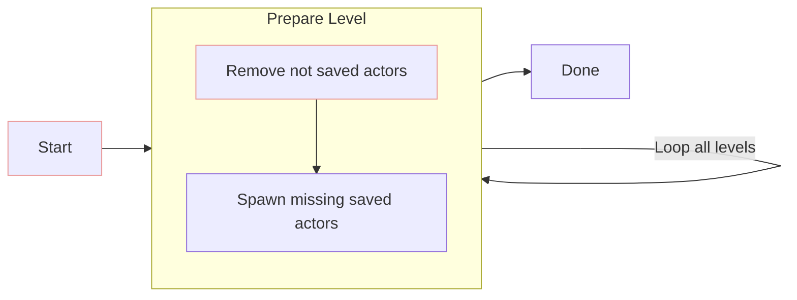
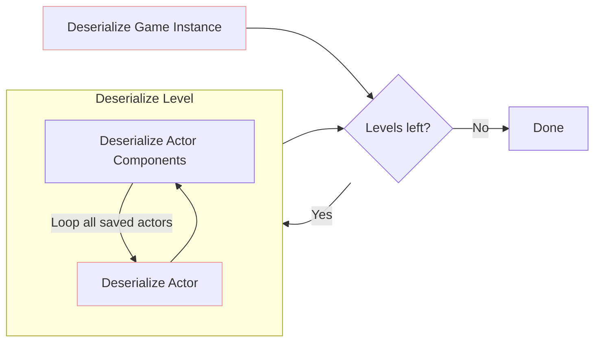

# Loading
Loading is divided in many stages.

*Note: Dot lines(- - - -) mean concurrency*

## Bake filters
In this step, all level filters and the general one are baked.
We need this to check which actors to prepare in each level, and how to deserialize.

## Prepare levels
We must ensure actor correctness before loading the data into actors.
That means all actors that were saved have to be restored, and actors that should not exist have to be deleted.

## Deserialize World
This is where the magic happens. The system goes through each actor to be loaded and deserializes its data from its record.

