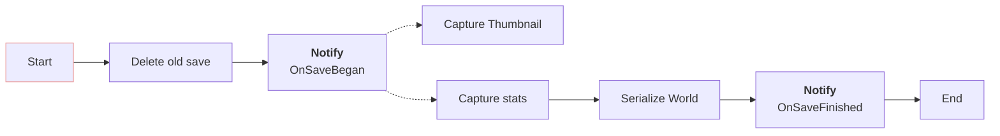
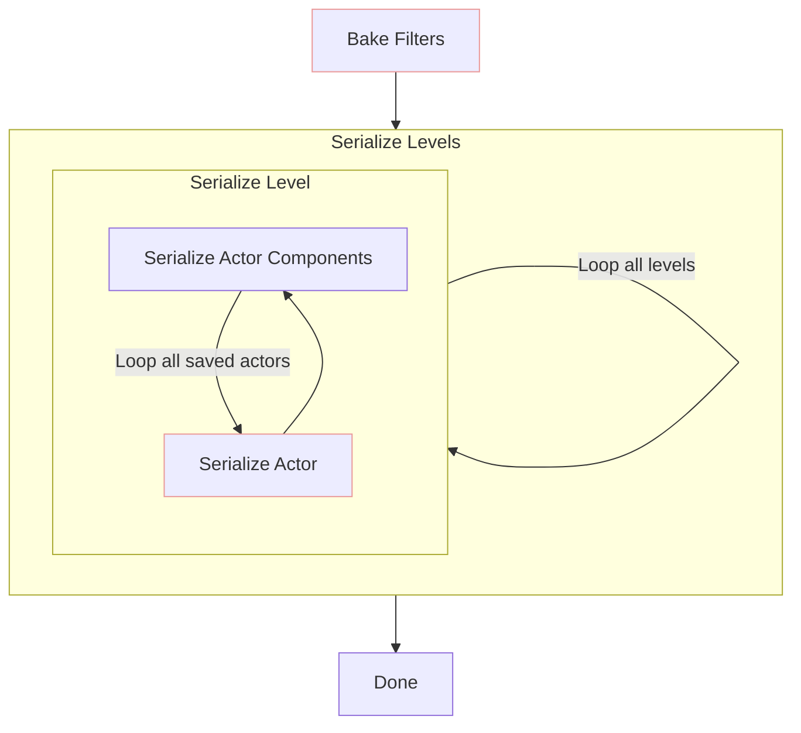

# Saving
Saving is divided in many stages:

*Note: Dot lines(- - - -) mean concurrency*

## Capture thumbnail
Runs independently from the rest of the save process. An screenshot of the desired characteristics will be queued in ue4's system and then saved with its correct name after x frames.

## Capture stats
Store game time, current map, filters and more inside a new SlotData object.

## Serialize World
We iterate all actors to be saved and serialize each of them.

If **MultithreadedSerialization** is *SaveAsync* or *SaveAndLoadAsync*, actors to be deserialized will be distributed between all available threads.
