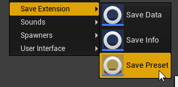
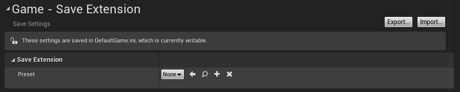
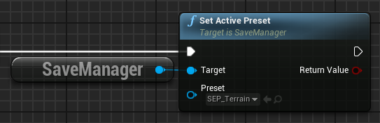
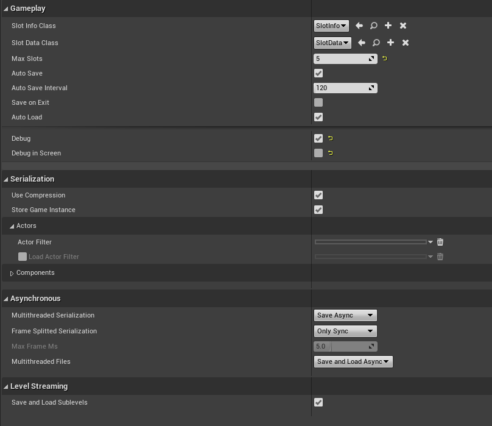
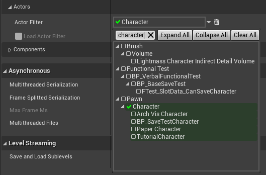
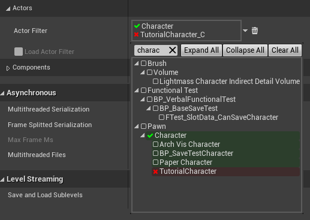

# Presets

A preset is a blueprint that allows the system to know the specifics about how to save the game. It contains all possible options and customizations the system can use.
That includes when, how and what to save, asset names, multithreading, custom logic,  etc.

## How-To

### Creating a preset

From the content browser, we can create a normal blueprint inheriting **USavePreset**, or just click *Save Extension -> Save Preset*

### Setting the active preset

To set the preset that the system will use when starting up, go to *Project Settings -> Game -> Save Extension*

Then we assign our preset class we want to use in **Preset**.

#### In Blueprints

The preset can also be changed from blueprints in runtime by calling:

## Settings

?> All settings have **tooltips** describing what they are used for. Check them by moving your mouse over the property.

A brief overview of the settings available:

* **Gameplay**: Configures the runtime behavior of the plugin. Debug settings are also inside Gameplay. [Check Saving & Loading](saving&loading.md)
* **Serialization**: Toggle what to save from the world.
  * **Compression**: This settings can heavily reduce saved file sizes, but add an small extra cost to performance.
* **Asynchronous**: Should save & load be [asynchronous](asynchronous.md)?
* **Level Streaming**: Configures [Level Streaming](level-streaming.md) serialization

## Filters

Filters allow us to select which classes will be saved and which classes won't.
This applies to actors and components and can be edited from the Preset.

### Allowing classes

If a class is added to a filter, that class and all its children will be allowed, meaning they will be considered for saving, their properties will be saved, etc.

*In the image: We allow Character, so all children character classes will be saved.*

### Rejected classes

We can also reject classes from a filter, meaning they wont be considered for saving.
?> Only children classes of allowed classes will be allowed to be rejected.

*In the image: We reject TutorialCharacter from the previous image, essentially saving all characters except TutorialCharacters.*